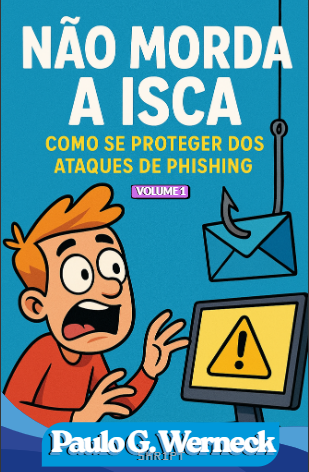

# Não Morda a Isca - Um Guia Prático Contra Phishing

### *"Um clique curioso e suas fotos viram reféns. Pense bem, antes que seu computador comece a pedir resgate."* 

  

  

## 📖 Sobre o E-book

"Não Morda a Isca" é um guia em formato de história em quadrinhos que narra o que acontece quando um simples e-mail de "jogo grátis" se transforma em um pesadelo digital. Acompanhe a jornada do nosso protagonista e aprenda de forma visual e direta a identificar os sinais de um ataque de phishing, entendendo as graves consequências de uma forma que um manual técnico tradicional não consegue mostrar.

## 🚀 O Projeto

Este e-book foi desenvolvido como parte de um desafio de projeto da **[DIO](https://dio.me/)**, com o objetivo de explorar o uso de Inteligências Artificiais como ferramentas para acelerar e viabilizar a criação de conteúdo criativo e educativo. Todo o roteiro e as ilustrações foram gerados a partir de IAs, com curadoria e diagramação humanas para dar vida à história.

## 🛠️ Ferramentas e Tecnologias

* **Roteiro e Textos:** `ChatGPT + Gemini`
* **Ilustrações:** `ChatGPT + Gemini Banana`
* **Diagramação:** `Canva + Powerpoint`
* **Organização de Ideias:** `Obsidian`

## 🤖 Bastidores da Criação: Os Prompts de IA

A seguir, os principais prompts utilizados para dar vida a este projeto.

  
<strong>Clique para ver o Prompt de Roteiro (ChatGPT)</strong>

  
   
  
  > Crie o roteiro para um e-book em formato de história em quadrinhos sobre os perigos do phishing e ransomware. O personagem principal, um jovem, recebe um e-mail falso oferecendo um jogo grátis. Descreva a história em etapas: 1. Ele fica animado e clica para baixar o arquivo. 2. Após a instalação, o computador trava e exibe uma mensagem de ransomware. 3. Explique de forma simples o que aconteceu: o programa era um malware que realizou o roubo de dados (exfiltração) e depois criptografou os arquivos (ransomware). O tom deve ser educativo e de alerta, mas com uma linguagem fácil para que quem não for da àrea entenda.

  
<strong>Clique para ver os Prompts Visuais (IA de Imagem)</strong>

  
   
  
  - **Capa:** *Um anzol de pesca fisgando um cursor de mouse, em um fundo digital. O título é "NÃO MORDA A ISCA". Estilo de arte em quadrinhos (comic book style), cores vibrantes e traços bem definidos.*
  - **Personagem em Pânico:** *Um jovem em pânico na frente de um computador que exibe um grande símbolo de alerta amarelo, com balões de exclamação sobre sua cabeça. Seus cabelos estão bagunçados e ele está com as mãos na cabeça. Estilo de arte cartoon/quadrinhos.* 
  - **Tela de Ransomware:** *Uma tela de computador exibindo uma mensagem de resgate assustadora com o texto "SEUS ARQUIVOS ESTÃO CRIPTOGRAFADOS E EXTRAIMOS TODOS OS DADOS E SENHAS", em um estilo de alerta vermelho e preto.* 

## 📁 Estrutura do Repositório

- **/assets**: Contém todos os ativos visuais, como a capa e as ilustrações utilizadas no e-book.
- **/output**: Contém a versão final do e-book em formato PDF, pronto para leitura.
- **README.md**: Este arquivo que você está lendo, com a documentação do projeto.

## 👨‍💻 Autor

| [ Paulo  G.  Werneck](https://github.com/5kr1pt) |
| :--------------------------------------------------------------------------------------------------------------------------------------: |

Feito por Paulo G. Werneck.

---

## 📜 Licença

Este projeto é distribuído sob a **Licença MIT**. Veja o arquivo `LICENSE` para mais detalhes.

*Nota sobre o conteúdo gerado por IA: As partes deste projeto, como o roteiro, a arte e o áudio, foram geradas com o auxílio de ferramentas de Inteligência Artificial sob a direção criativa do autor. A licença se aplica à compilação do projeto, aos prompts originais e a todas as outras contribuições de autoria humana.*
